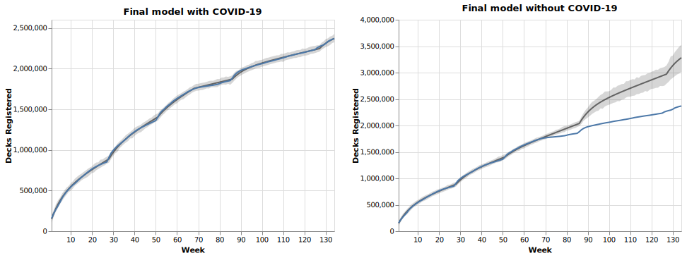

[](https://mybinder.org/v2/gh/4dcu-be/BayesianSalesAnalysis/HEAD)

# BayesianSalesAnalysis


In these notebooks [PyMC3] is used to model the number of registered [KeyForge] decks. Data on the weekly registragions was provided by Duk from [Archon Arcana]. Names of Dark Tidings decks for the second part to estimate the total number of decks printed were provided by Saluk, another member of [Archon Arcana]

For more details read the corresponding blog post on 4DCu.be [here](http://blog.4dcu.be/programming/games/2021/07/04/Bayesian-sales-analysis.html)

Using PyMC3 we model the number of registrations including releasing new sets and the global outbreak of COVID-19. Once a good model was found, we also check how many decks would have been registered if COVID-19 didn't put the world in lockdown.




## Running the Notebook

You can open the notebooks on [Binder](https://mybinder.org/v2/gh/4dcu-be/BayesianSalesAnalysis/HEAD).

To get the code running locally the easiest option is using [Anaconda]

```bash
git clone https://github.com/4dcu-be/BayesianSalesAnalysis
cd BayesianSalesAnalysis
conda env create -f environment.yml
conda activate pymc3
jupyter notebook
```

In case you are running this on windows you might need to install libpython in the environment and you will need Visual Studio Code 2017 build tools (with the C tools, check the options).


[PyMC3]: https://docs.pymc.io/
[KeyForge]: https://www.keyforgegame.com/
[Archon Arcana]: https://archonarcana.com/Main_Page
[Anaconda]: https://anaconda.org/
